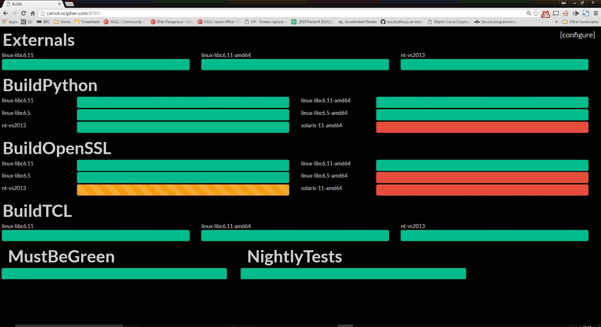

# JenkinsBoard
An auto-layout build feedback board for Jenkins

# Instructions
1. Clone the git repo
2. Edit settings.json to set your jenkins master with the FQDN of your jenkins server.
3. Start webserver.py (under a screen session?) Optionally adding a port number on the command line.

# Adding jobs to the view
1. Go to the "/admin" page
2. Put the URL to your jenkins master into the address box
3. Save
4. Select your jobs and hit Save again
